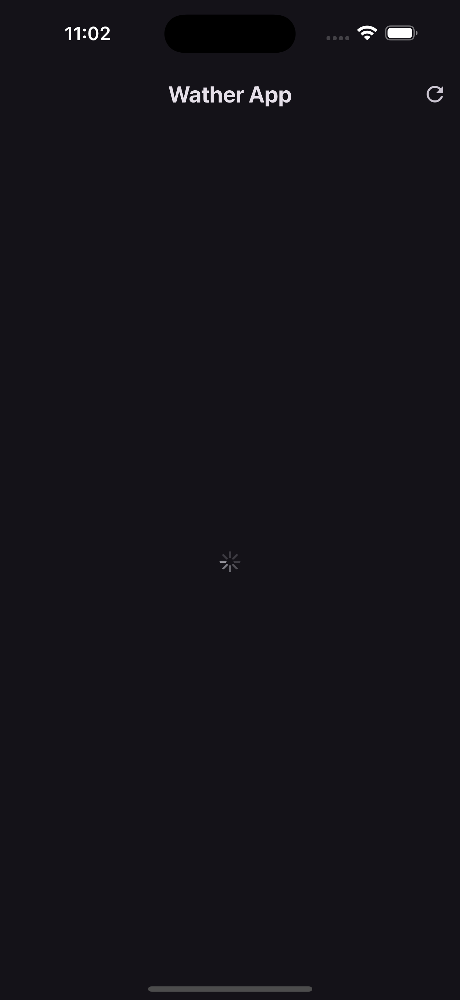

# Weather Forecast App ☀️🌧️

A modern and responsive weather forecasting app built with Flutter. This app provides accurate, up-to-date weather information for any city worldwide, featuring a sleek, user-friendly interface optimized for both mobile and web platforms.

---

    
    

  

*The images above showcase the app's main UI and loading screen.*

---

## Features 🌍

- **Current Weather**: Provides real-time weather data, including temperature, humidity, wind speed, and more.
- **7-Day Forecast**: A detailed weather forecast for the upcoming week.
- **Search Functionality**: Search by city name to get instant weather information for any location worldwide.
- **Location-Based Forecast**: Uses your current location to automatically show the weather in your area.
- **Beautiful UI**: Clean, modern interface with icons and graphics representing different weather conditions.
- **Responsive Design**: Optimized for mobile and web with smooth transitions and layout adjustments for various screen sizes.
